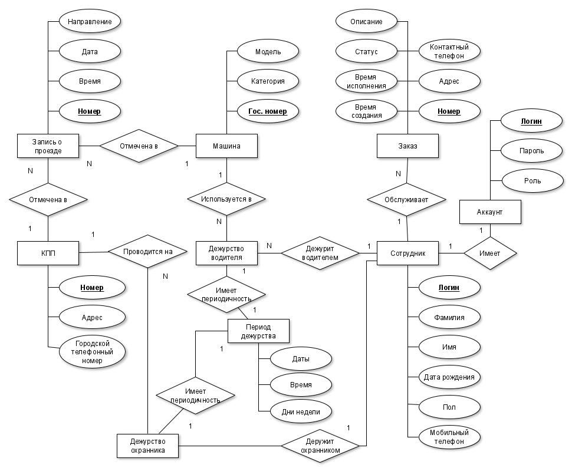
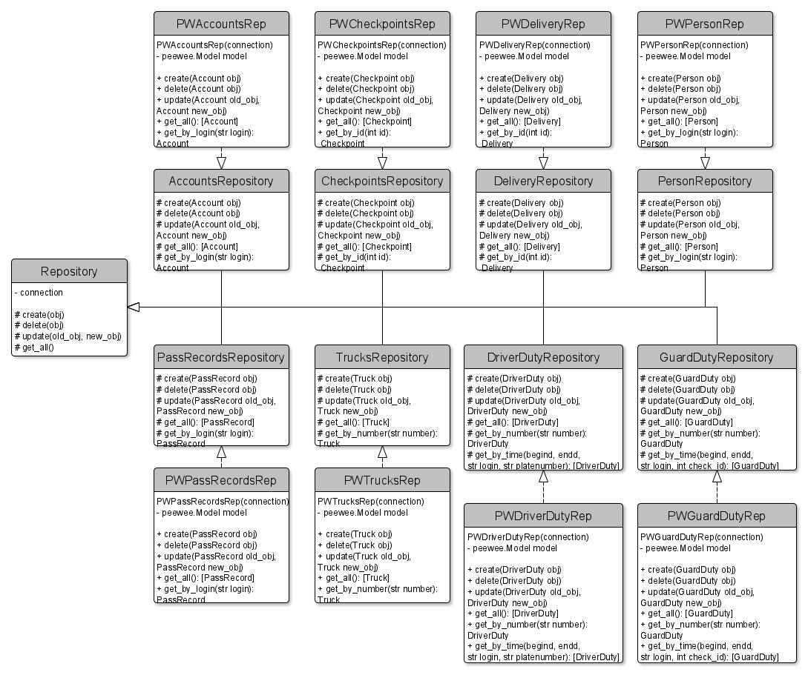
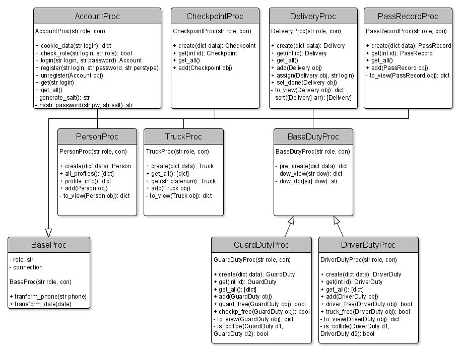
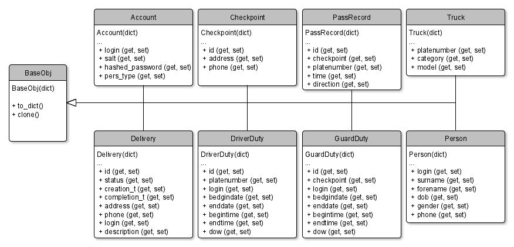
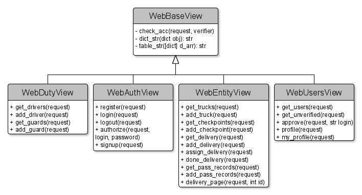
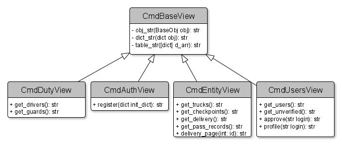
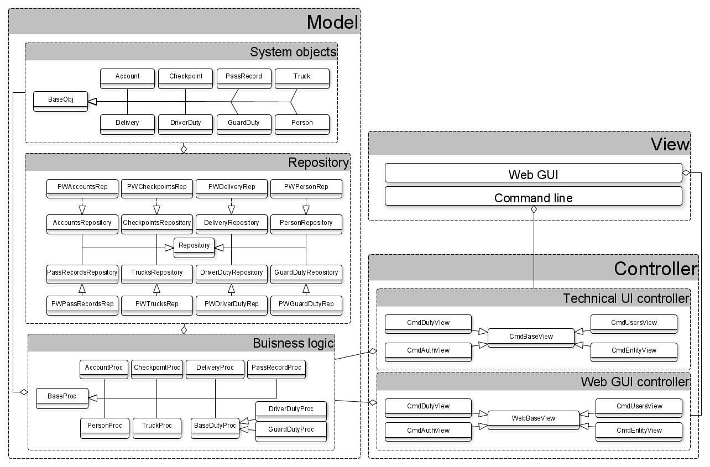

# Курсовая по Базам Данных / Лабораторные ППО

## Use-Case - диаграмма  

## ER-диаграмма сущностей  

## Технологический стек
* Фреймворк для веб-приложения - **Django** 
* Язык программирования - **Python**
* СУБД - **PostgreSQL**
* ORM - **Peewee**
* Тип приложения - **Web MPA**

## UML диаграмма компонента доступа к данным

## UML диаграмма компонента с бизнес-логикой

## ER диаграмма сущностей БД

## UML диаграмма сущностей системы

# Лабораторная работа 2
## UML-диаграммы классов для компонента/модуля, связывающего GUI и бизнес-логику

## UML-диаграмма классов для технологического UI ко всем функциям системы

## UML-диаграмма компонентов для всего приложения

