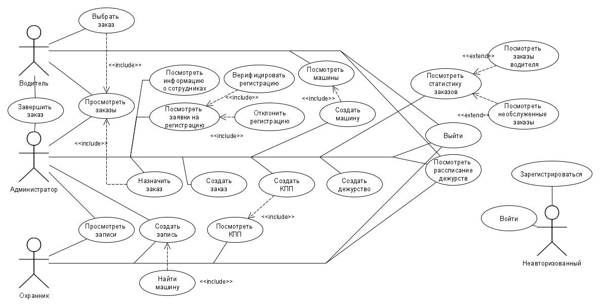
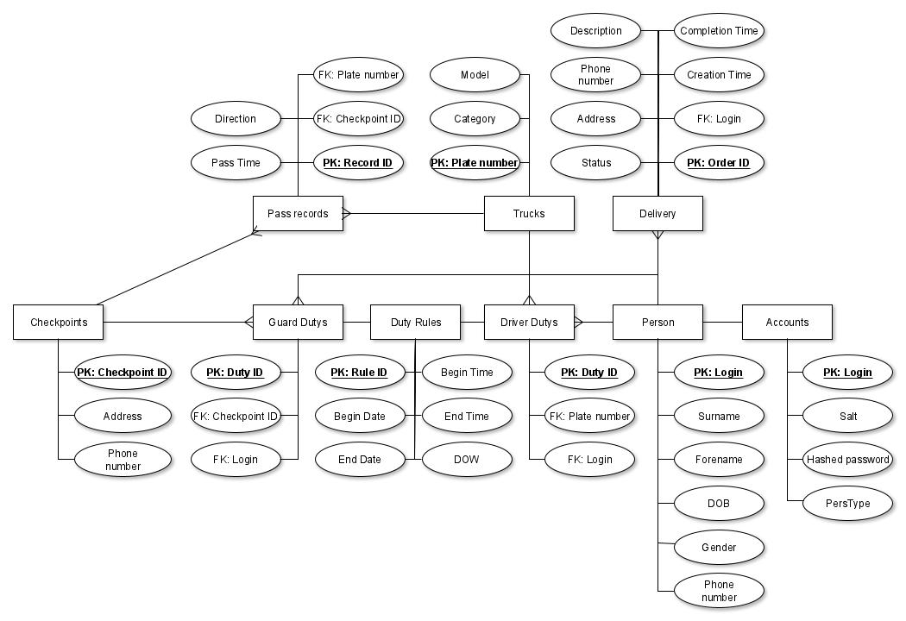

# Курсовая по Базам Данных / Лабораторные ППО

## Use-Case - диаграмма  

## ER-диаграмма сущностей  

## Описание типа приложения
Web-Spa

## Технологический стек
* Фреймворк для веб-приложения - **Django** 
* Язык программирования - **Python**
* СУБД - **PostgreSQL**
* ORM - **Peewee**

## UML диаграмма компонента доступа к данным
WIP

## UML диаграмма компонента с бизнес-логикой
WIP

## ER диаграмма сущностей БД

## UML диаграмма сущностей системы
WIP

## UML диаграмма транспортных сущностей
WIP
